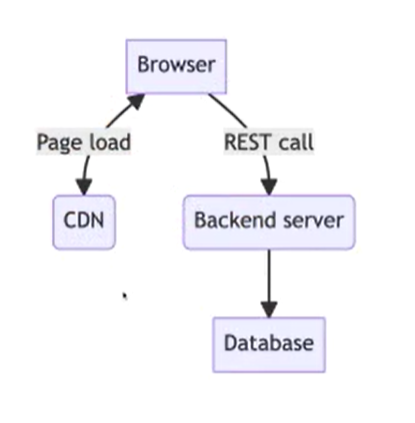
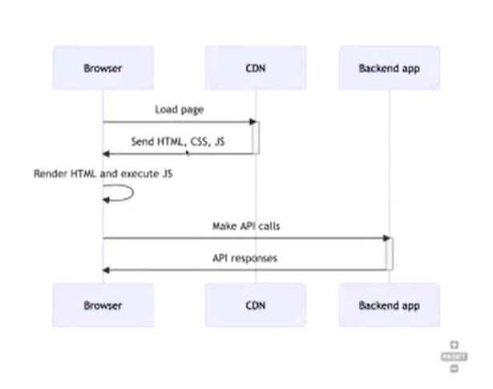
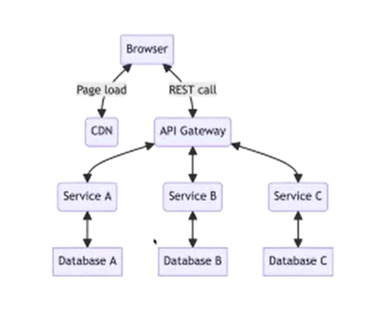
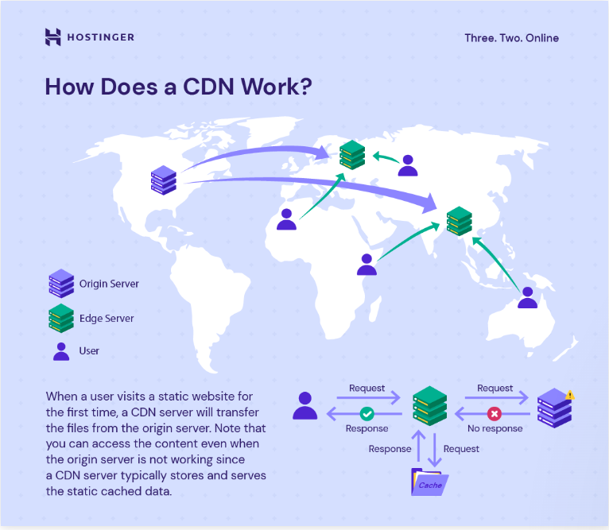

### Java backend engineer?

A person whole build Java backends

End users are not customers but other developers ( front end )

API : Application programming interface, we write code to interface with other piece of code

### Three tier architecture

* In Java, we have three tier architecture which consists of frontend, mid tier (backend) and database

* Now a days, it’s a bit different. 

* Browser makes a request to a CDN instead of backend, as most of the applications today are rich client applications.

* CDN returns a static page which has HTML, CSS and JS which are executed in browser. The javascript makes the REST call to backend.

  

*The Three tier architecture*

* Backend talks with the database and sends response to frontend with requested information

* The flow is as shown in the figure below

  

* The three tier architecture with backed built with microservice architecture is as follows

  

* The difference when requesting is, the front end requests are sent to API Gateway.

* API Gateway is kind of centralized location which acts like a façade for front end and has services underneath it which dynamically routes the requests to correct APIs.

* For ex, when a request is made to www.amazon.com/profile, the API gateway routes the call to profile service and www.amazon.com/cart routes the call to cart service.

* In Microservices, every service has its own database. Services can talk with each other but can’t access each other’s databases directly.

* There are multiple copies of servers so that if one server fails the other servers can serve the application.

* API gate way can be bundled with load balancer or can have separate load balancer.

* This load balancer efficiently distributes the incoming network traffic across the servers.

  ### How a web request work?

* The first thing that the browser does when we search for a URL is make a call to CDN.

  ##### CDN (Content Delivery Network): 

  * Distributed servers that deliver web content to users based on their geographic location.

  * Stored on multiple servers in various locations.

  * When the request comes, it routes the request to the server closest to the user

  * This is faster than getting from the origin server.

  * CDN has two type of servers

    1. Origin server :  The server where we deploy our code; main servers.

    2. Edge server : Copies of origin servers

    

    ##### 

  ##### A web request

  * The browser sends a request to the DNS servers to resolve the domain name of the URL to its corresponding IP address.

  * The DNS server returns the IP address of the closest CDN edge server to the user’s location so the request will be sent as fast as possible.

  * The CDN edge server checks its cache, if any changes are there in origin servers it refreshes to get the new data.

  * If found is cache, it servers directly otherwise makes a call to origin server to get the content and saves in cache and returns to the user.

  ##### A web page

  * The content served from CDN is static content which has

    * A HTML page

    * CSS assets

    * Images

    * JS assets

    * Fonts

  * The above all combined form a webpage

  ##### REST requests

  * Javascript code constructs an HTTP request

  * Adds endpoint API URL and HTTP method

  * So the JS should know API URL and HTTP method(GET/POST/PATCH/DELETE)

  * Also includes necessary parameters or data

  * For ex. Lets we want to create some data, the data should be sent in request body.

  * Server gets this request and returns response,

  * JS receives response and processes it and manifests as UI change.

  ##### A Capable backend

  A capable backend should be able to do the following

  * Intercept requests

  * Extract data from requests

  * Process the request

  * Pull necessary data from database

  * Process the data and prepare response

  * Return the response.

  ##### Handling requests

  A request is HTTP request. HTTP stands for **HyperTextTransferProtocol**

  A message sent by a client such as web app to a server to request specific information